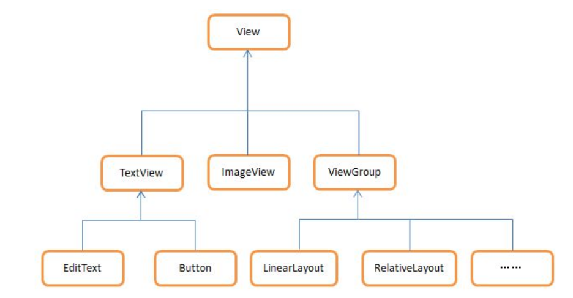

###{{ page.title }}

　　Android是使用Task来管理活动的，一个任务就是一组存放在栈里的活动的集
合，这个栈也被称作为返回栈（Back Stack）。栈式一种后进先出的数据结
构。

　　每一个活动在其生命周期中最多可能有四种状态

* 运行状态
    + 当一个活动位于返回栈的栈顶时，这时活动处于运行状态，系统最不愿
    回收的就是处于运行状态的活动。
* 暂停状态
    + 当一个活动不再处于栈顶位置，但仍然可见时，这时活动就进入暂停状
    态。处于暂停状态的活动仍然式完全存活着的，系统也不愿意去回收这种
    活动。
* 停止状态
    + 当一个活动不再处于栈顶位置，并且完全不可见的时候，就进入了停止
    状态。系统仍然会为这种活动保存相应的状态和成员变量，但是这并不是
    完全可靠的，当其他地方需要内存时，处于停止状态的活动有可能会被系
    统回收。
* 销毁状态
    + 当一个活动从返回栈中移出后就变成了销毁状态。系统会最倾向于回
    收这种状态的活动。

Activity的生存期

1. onCreate()

    这个方法在活动第一次被创建的时候调用。应该在这个方法中完成活动的
    初始化操作，比如加载布局，绑定事件等。

2. onStart

    这个方法在活动由不可见变成可见的时候调用。

3. onResume

    这个方法在活动准备好和用户进行交互的时候调用。此时的活动一定位于
    返回栈的栈顶，并且处于运行状态

4. onPause

    这个方法在系统准备去启动或者恢复另一个活动的时候调用。通常会在这个
    方法中将一些消耗CPU的资源释放掉，以及保存一些关键数据，但是这个
    方法的执行速度一定要快，不然会影响到栈顶活动的使用。

5. onStop

    这个方法在活动完全不可见的时候调用。它和onPause的主要区别在与，
    如果穷的能够的新活动式一个对话框式的活动，那么onPause会执行，
    而onStop方法并不会执行。

6. onDestroy

    这个方法在活动被销毁之前调用，滞后活动的状态就成为销毁状态。

7. onRestart

    这个方法在活动由停止状态变成运行状态之前调用，也就是活动被重新
    启动。

上面的七个方法中除了onRestart外其他都是两两对应的。因此有可以将活动
分成三种生存期。

1. 可见生存期

    活动在onStart和onStop方法之间所经历的，就是可见生存期。在可见生
    存期内，活动对于用户总是可见的，即便有可能无法和用户进行交互。

2. 前台生存期

    活动在onResume和onPause之间所经历的就是前台生存期。在前台生存期
    活动总是处于运行状态，此时的活动是可以和用户进行交互的。

3. 完整生存期

    活动在onCreate和onDestroy之间经历的，就是完整生存期。

**活动的启动模式**

#####活动的启动模式共有四种：

1. standard 
    standard是默认的启动模式

2. singleTop
    当活动的启动模式式singleTop，在启动该活动时如果发现返回的栈顶
    已经式该活动，则认为可以直接使用它而不再创建新的活动实例。

3. singleTask
    当活动的启动模式式singleTask时，每次启动该活动系统首先会在返回
    栈中检查是否存在该活动的实例，乳沟发现已经存在，则直接使用该实例
    ，并把在这个活动之上的活动统统出栈，如果么有发现就会创建一个新的
    活动实例。

4. singleInstance
    指定singleInstance模式的活动会启用一个新的返回栈来管理这个活动。
    采用这种模式可以解决共享活动实例的问题。

**Android中的四种最基本的布局**

1. LinearLayout

    线性布局，是一种非常常用的布局。这种布局会将它所包含的控件在线性
    方向上一次排列。
    
    通过android:orientation属性可以指定派来方向(vertical & horizontal)
    如果没有指定orientation属性的值，默认的排列方向就是horizontal。
    
    如果排列方向式horizontal，内部的控件就绝对不能将宽度指定为
    match_parent,因为这样的话单独一个控件就会将整个水平方向占满，
    其他的控件就没有位置可以放置了。同理，如果排列方向式vertical，内
    部的控件就不能将高度指定为match_parent。

    关键属性的用法：
    + android:layout_gravity
    
        用于指定控件在布局中的对齐方式。
    + android:gravity
    
        用于指定文字在控件中的对齐方式。
    + android:layout_weight
    
        这个属性允许我们使用比例的方式来指定控件的大小，它在手机屏幕的
        适配性方面可以起到非常重要的作用。
        使用layout_weigh属性之后，控件的宽度就不再受android:layout_width
        来决。此时layout_width指定为0是一种比较规范的写法。

2. RelativeLayout

    相对布局，也是一种非常常用的布局。相对布局可以通过相对定位的方式
    让控件出现在布局的任何位置。

    关键属性的用法：
    + android:layout_above 
    
        让一个控件在另一个控件的上方。需要为这个属性指定相对控件id
        的引用。
    + android:layout_below
    
        表示让控件位与另一个控件的下方。
    + android:layout_toLeftOf
    
        表示让一个控件位与另一个控件的左侧。
    + android:layout_toRightOf
    
        表示让一个控件位于另一个控件的右侧
    + android:layout_alignLeft
    
        表示控件让另一个控件的左边缘和另一个控件的左边缘对齐。
    + android:layout_alignRight
    + android:layout_alignTop
    + android:layout_alignBottom

3. FrameLayout

    这种布局没有任何的定位方式，所有的控件都会摆放在布局的左上角。

4. TableLayout

    这种布局允许我们使用表格的方式来排列控件，这种布局也不是很常用。

    android:stretchColumns=”1”
    
    表示如果表格不能完全占满屏幕宽度，就将第二行进行拉伸。这里指定成
    1就是拉伸第二列，0拉伸第一列，类推。

通过include可以非常方便的引用一个布局，同时解决了重复编写布局代码的问
题，但是如果布局中有一些控件要求能够响应时间，我们还是需要在每个活动
中为这些控件单独编写一次时间注册的代码。

**最常用的控件ListView**

ListView允许用户通过手指上下华东的方式将屏幕外的数据滚动到屏幕内，
同时屏幕上原有的数据则会滚出屏幕.

数组的数据是无法直接出传递给ListView的，我们还需要借助适配器来完成。
android提供了很多适配器的实现类，ArrayAdapter可以通过泛型来指定要
适配的数据类型，然后在构造函数中把要适配的数据传入即可。

android.R.layout.simple_list_item_1是一个android的内置的布局文件，
里面只有一个TextView，可以用于显示一段文本。

Android中的单位和尺寸

+ px 

    pｘ是像素的意思，即屏幕中可以显示的最小元素单元。

+ pt
    
    pt是磅数的意思，１磅== 1/72英寸。

+ dp
    
    dp 也是dip，是密度无关像素的意思。它在不同密度的屏幕中的显示比例
    将保持一致。

+ sp

    sp是可伸缩像素的意思。

**碎片和活动之间进行通信**

为了方便碎片和活动之间进行通信，FragmentManager提供了一个类似于
findViewById()的方法专门用于从布局文件中获取碎片的实例。

*example code:*

    RightFragment RightFragment = (Rightfragment) getFragmentManger().findFragmentById(R.id.right_fragment);

通过调用FragmentManager的findFragmentById()方法，可以在活动中得到相应
碎片的实例，然后就能轻松的调用碎片李宓的方法。

碎片(Frag)中如何调用活动里的方法，在每个碎片中都可以通过调用
getActivity()方法来得到和当前碎片相关联的活动实例

*example code:*

    MainActivity activity = (MainActivity) getActivity();

有了活动实例之后，在碎片中调用活动里的方法就变得轻而易举。另外当碎片中
需要使用Context对象的时候，也可以使用getActivity()方法，因为获取到
的活动本身就是一个Context对象了。

**碎片的生命周期(Fragment)**

1. 运行状态
    
    当一个碎片是可见的，并且它所关联的活动正处于运行状态时，该碎片也
    处于运行状态。

2. 暂停状态

    当一个活动进入暂停状态，与它相关联的可见碎片就会进入到暂停状态

3. 停止状态

    当一个活动进入停止状态时，与它相关联的碎片就会进入到停止状态，
    或者通过调用FragmentTransaction的remove(), replace()方法将碎片从
    活动中移出，但有在事务提交前调用addToBackStack()方法，此时碎片也进入
    到暂停状态。

4. 销毁状态

    碎片总是依附于活动而存在的,因此当活动被销毁时,与它相关联的碎片就会进入
    到销毁状态。或者通过调用 FragmentTransaction 的 remove()、replace()方法将碎片从活
    动中移除,但在事务提交之前并没有调用 addToBackStack()方法,这时的碎片也会进入
    到销毁状态。

**活动中有的回调方法,碎片中几乎都有,不过碎片还提供了一些附加的回调方法**

1. onAttach()
    
    当碎片和活动建立关联的时候调用。

2. onCreateView()

    为碎片创建视图(加载布局)时调用。

3. onActivityCreated()

    确保与碎片相关联的活动一定已经创建完毕的时候调用。

4. onDestroyView()

    当与碎片关联的视图被移除的时候调用。

5. onDetach()

    当碎片和活动解除关联的时候调用.

**广播机制简介**

+ 标准广播

    标准广播是一种完全异步执行的广播，在广播发出去之后，所有的广播接收器
    几乎都会在同一时刻接收到这条广播消息，因此它们之间没有任何先后顺序

    这种广播效率比较高，但是也意味着它是无法被截断的。

+ 有序广播

    有序广播式一种同步执行的广播，在广播发出之后，则同一时刻只有一个广播
    接收器能够收到这条广播消息，当这个广播接收器中的逻辑执行完毕后，广播
    才会继续传递。

广播注册方式：

1. 动态注册

    在代码中注册

2. 静态注册

    在AndroidManifest.xml中对广播接收器进行注册。

文件存储：

    其实所用到的核心技术就是 Context
    类中提供的 openFileInput()和 openFileOutput()方法,之后就是利用 Java 的各种流来进行读写
    操作就可以了。

将数据存储到 SharedPreferences :

    要想使用 SharedPreferences 来存储数据,首先需要获取到 SharedPreferences 对象。 Android
    中主要提供了三种方法用于得到 SharedPreferences 对象。

    1. Context 类中的 getSharedPreferences()方法
        
        此方法接收两个参数,第一个参数用于指定 SharedPreferences 文件的名称,如果指
        定的文件不存在则会创建一个,SharedPreferences 文件都是存放在/data/data/<package
        name>/shared_prefs/目录下的。第二个参数用于指定操作模式,主要有两种模式可以选
        择,MODE_PRIVATE 和 MODE_MULTI_PROCESS。MODE_PRIVATE 仍然是默认的操
        作模式,和直接传入 0 效果是相同的,表示只有当前的应用程序才可以对这个
        SharedPreferences 文件进行读写。 MODE_MULTI_PROCESS 则一般是用于会有多个进程中
        对同一个 SharedPreferences 文件进行读写的情况。

    2. Activity 类中的 getPreferences()

        这个方法和 Context 中的 getSharedPreferences()方法很相似,不过它只接收一个操
        作模式参数,因为使用这个方法时会自动将当前活动的类名作为 SharedPreferences 的文
        件名。

    3. PreferenceManager 类中的 getDefaultSharedPreferences()方法

        这是一个静态方法,它接收一个 Context 参数,并自动使用当前应用程序的包名作
        为前缀来命名 SharedPreferences 文件。

得到了 SharedPreferences 对象之后,就可以开始向 SharedPreferences 文件中存储数据了,
主要可以分为三步实现。

1. 调用 SharedPreferences 对象的 edit()方法来获取一个 SharedPreferences.Editor 对象。
2. 向 SharedPreferences.Editor 对象 中添 加数 据, 比如 添加一 个布 尔型 数据 就使 用
putBoolean 方法,添加一个字符串则使用 putString()方法,以此类推。
3. 调用 commit()方法将添加的数据提交,从而完成数据存储操作。

**创建内容提供器**

1. onCreate()

    初始化内容提供器的时候调用。通常会在这里完成对数据库的创建和升级等操作,
    返回 true 表示内容提供器初始化成功,返回 false 则表示失败。注意,只有当存在
    ContentResolver 尝试访问我们程序中的数据时,内容提供器才会被初始化。

2. query()

    从内容提供器中查询数据。使用 uri 参数来确定查询哪张表,projection 参数用于确
    定查询哪些列,selection 和 selectionArgs 参数用于约束查询哪些行,sortOrder 参数用于
    对结果进行排序,查询的结果存放在 Cursor 对象中返回。

3. insert()

    向内容提供器中添加一条数据。使用 uri 参数来确定要添加到的表,待添加的数据
    保存在 values 参数中。添加完成后,返回一个用于表示这条新记录的 URI。

4. update()

    更新内容提供器中已有的数据。使用 uri 参数来确定更新哪一张表中的数据,新数
    据保存在 values 参数中,selection 和 selectionArgs 参数用于约束更新哪些行,受影响的
    行数将作为返回值返回。

5. delete()

    从内容提供器中删除数据。使用 uri 参数来确定删除哪一张表中的数据,selection
    和 selectionArgs 参数用于约束删除哪些行,被删除的行数将作为返回值返回。

6. getType()

    根据传入的内容 URI 来返回相应的 MIME 类型。

**Android异步消息处理机制**

Android中的异步消息处理主要由四个部分组成，Message, Handler, MessageQueue
和Looper。

1. Message 
    
    Message是在线程指奸传递的消息，它可以在内部携带少量的信息，用于在不同
    线程之间交换数据。

2. Handler

    Handler就是处理者的意思，它主要用来发送和处理消息。发送消息一般是使用
    Handler的sendMessage()方法，而发送出去的消息经过一系列的辗转处理，
    最终会被传递到Handler的handleMessage()方法中。

3. MessageQueue

    MessageQueue式消息队列的意思，它主要用于存放所有通过Handler发送的消息

4. Looper

    Looper是每个线程中的MessageQueue的管家，调用Looper的loop()方法后，
    就会进入到一个无限循环中，每当它发现MessageQueue中存在一条消息后，
    就将它取出来，并传递到Handler的handlerMessage()方法中。

**AsyncTask**

借助 AsyncTask,即使你对异步消息处理机制完全不了解,
也可以十分简单地从子线程切换到主线程。当然,AsyncTask 
背后的实现原理也是基于异步
消息处理机制的,只是 Android 帮我们做了很好的封装而已

一个简单的自定义AsyncTask就可以写成如下方式：

    class DownloadTask extends AsyncTask<Void, Integer, Boolean> {
    .......
    }

经常需要去重写的方法有一下四个：

1. onPreExecute()
    
    这个方法在后台任务开始执行之前调用。

2. doInBackground(Parmas...)

    这个方法中的所有代码都会在子线程中运行,我们应该在这里去处理所有的耗时任
    务。任务一旦完成就可以通过 return 语句来将任务的执行结果返回,如果 AsyncTask 的
    第三个泛型参数指定的是 Void,就可以不返回任务执行结果。注意,在这个方法中是不
    可以进行 UI 操作的,如果需要更新 UI 元素,比如说反馈当前任务的执行进度,可以调
    用 publishProgress(Progress...)方法来完成。

3. onProgressUpdate(Progress...)

    当在后台任务中调用了 publishProgress(Progress...)方法后,这个方法就会很快被调
    用,方法中携带的参数就是在后台任务中传递过来的。在这个方法中可以对 UI 进行操
    作,利用参数中的数值就可以对界面元素进行相应地更新。

4. onPostExecute(Result)

    当后台任务执行完毕并通过 return 语句进行返回时,这个方法就很快会被调用。返
    回的数据会作为参数传递到此方法中,可以利用返回的数据来进行一些 UI 操作,比如
    说提醒任务执行的结果,以及关闭掉进度条对话框等。

怎么禁止EditText编辑:

    1: 设置android:editable=”false” android:focusable=”false”
    2: EditText.setFocusable(false) EditText.setFocusableInTouchMode(true)

